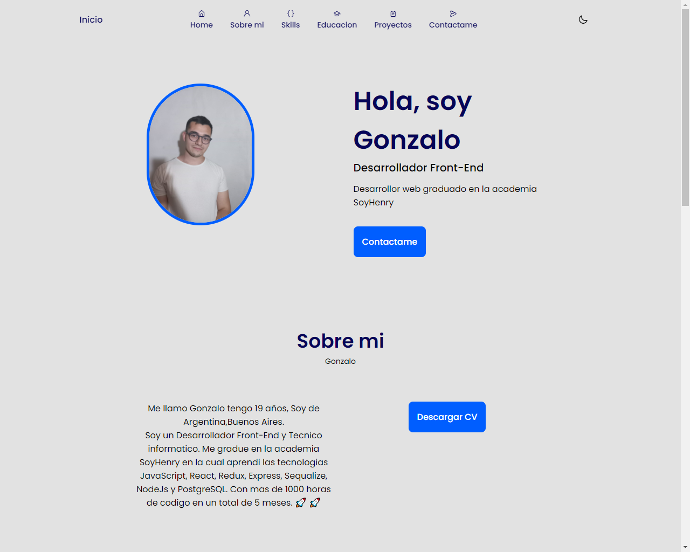
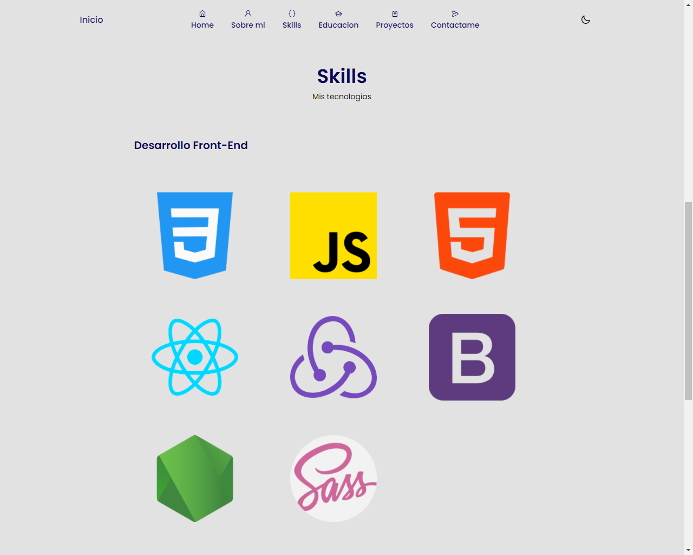
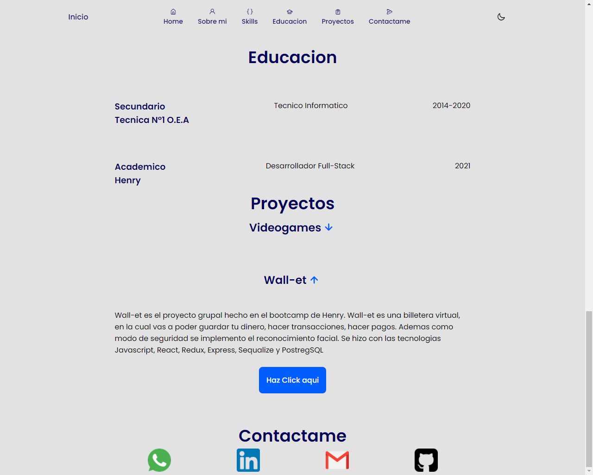
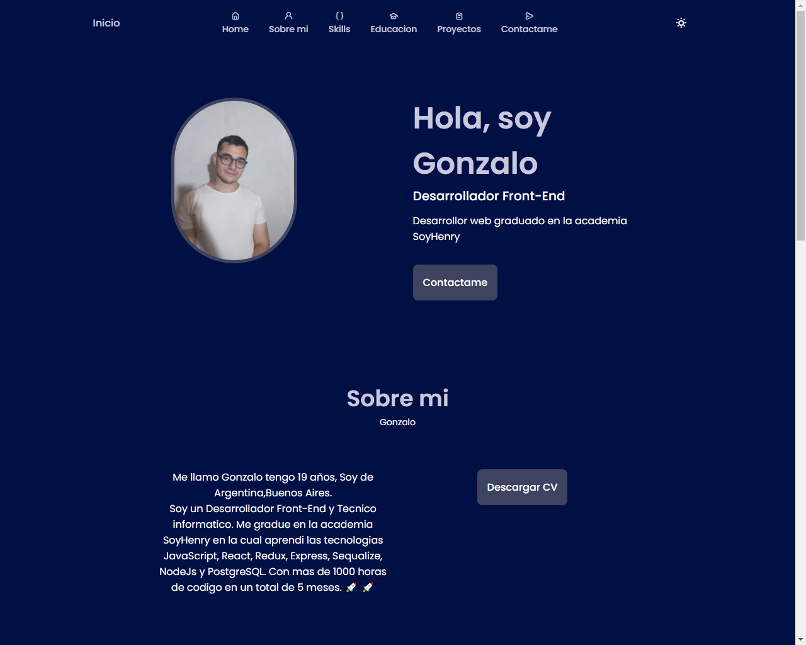
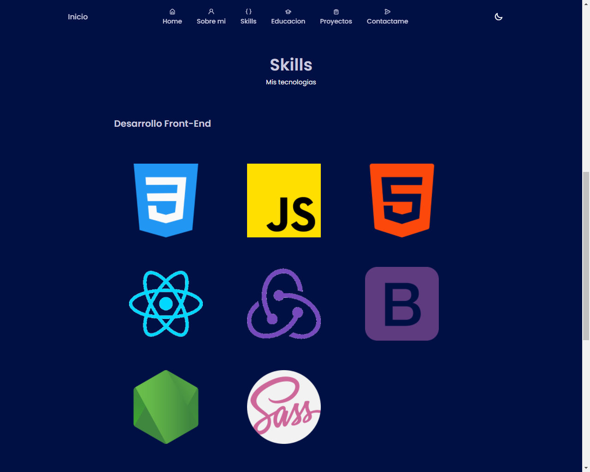
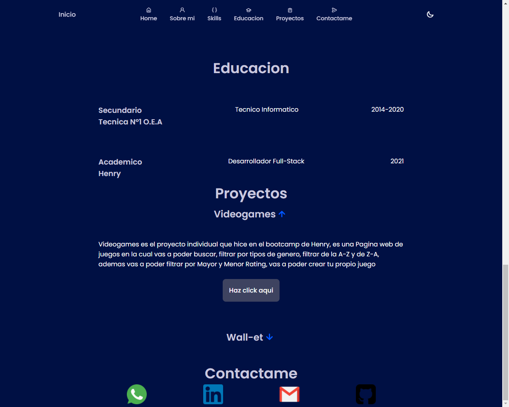

# Gonzalo Juarez
<h3>Hola!, bienvenidos al repositorio de mi portfolio. Este porfolio tarde 2 dias en hacerlo y tecnicamente fue sencillo. Muy pronto se viene uno nuevo con ReactJs</h3>

 
 

# Tecnologias

<h2>Las tecnologias que utilice fueron JavaScript, CSS3 y HTML5 </h2>

<h2>Haciendo click <a href='https://gonzalo-juarez-portoflio-kappa.vercel.app/'>Aqui </a> los llevara a la pagina ya deployada </h2>

pero...

<h3>Les dejo unas imagenes del Portfolio</h3>

 

 

 
 
<h3>Aqui el modo oscuro</h3>
 
 

 

 

